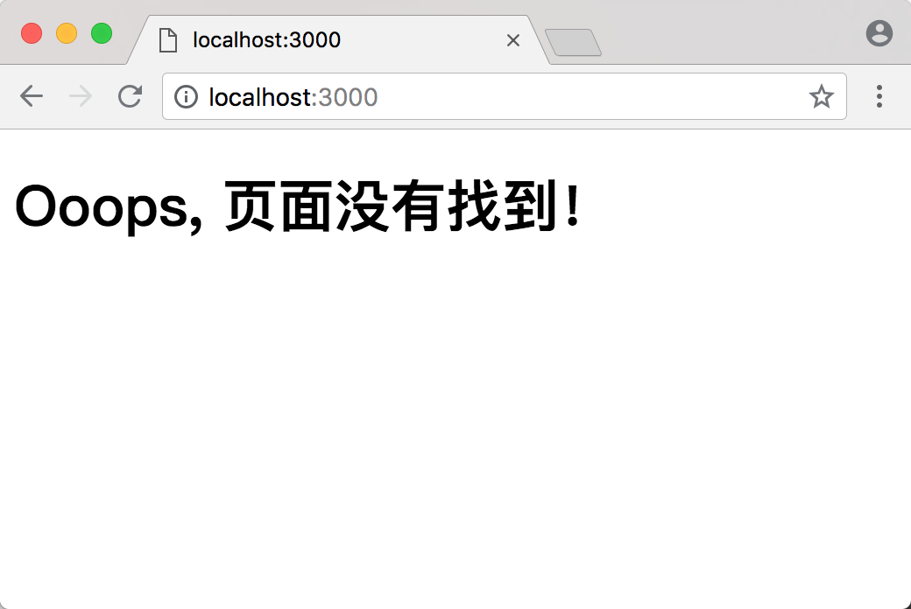

# 入门

创建一个单页应用程序(SPA: Single Page Application)是一件非常有挑战的事情，幸运的是，开源世界给我们提供了一些好用的工具来简化，加速单页应用的开发。

[Create React App](https://github.com/facebookincubator/create-react-app) 就是这样一种工具。

即使是这样，创建单页应用也有着非常高的学习曲线，仍然需要我们学习客户端路由、页面布局等技术。如果你还想要运行服务器端渲染(SSR: Server Side Rendering)，那么事情就变得更加困难了。

> 因此，我们需要一个简单并且可自定义的方案

想一下我们如何使用 PHP 创建 Web 应用程序？

首先创建一些文件，编写 PHP 代码，然后部署。 不用担心路由的问题，Web 应用程序只是在服务器端运行，并且输出 HTML 而已。

但这里我们说的不是用 PHP 来创建 Web 应用程序，我们将使用 Javascript 和 React 来构建应用，使用 dace 框架给我们提供以下能力：

- 服务器端渲染(默认)
- 自动代码切分，加速页面加载
- 简单的客户端路由(基于页面)
- 基于 Webpack 的开发环境，支持热模块替换(HMR: Hot Module Replacement)
- 使用 koa 做 web 服务器
- 使用 Babel 和 Webpack 配置定制

## 设置

Dace 可以在 Windows、Mac 和 Linux 上运行，只需要在系统中安装 Nodejs 即可开始构建 dace 应用程序。

除了需要一个文本编辑器编写代码，一个终端调用命令之外，没什么别的是必须的。

> 如果在 Windows 上运行，建议使用 PowerShell。dace 可以工作在任何 Shell 和终端下。 但是本指南中，我们使用 UNIX 相关的命令。
> 推荐在 Windows 下使用 PowerShell，让工作方便一些。

运行下面的命令，创建一个示例的项目:

```shell
mkdir hello-dace
cd hello-dace
npm init -y
npm install react react-dom dace
```

然后打开 `package.json`，添加下面的 npm 脚本命令:

```json
{
  "scripts": {
    "dev": "dace"
  }
}
```

现在，一切就准备好了，你可以运行下面的命令来启动开发服务器了。

```shell
npm run dev
```

在浏览其中打开: [http://localhost:3000](http://localhost:3000)。

## 404 页面

打开 [http://localhost:3000](http://localhost:3000)，我们看到的是一个 404 页面。 这个时候 dace 没有任何功能。 默认就是一个 404 页面。



## 创建第一个页面

现在我们来创建第一个页面。

新建 `src/pages/home` 目录
```sh
mkdir -p src/pages/home
```

在 `src/pages/home` 目录下创建一个名称为 `index.js` 的文件，内容如下:

```jsx
import React from 'react';

const Home = () => (
  <div>
    <p>Hello Dace</p>
  </div>
);

export default Home;
```

现在，再次访问 [http://localhost:3000](http://localhost:3000)，在页面上你会看到 "Hello Dace"。 这里，我们只是从 `src/pages/home/index.js` 模块导出了一个简单的 React 组件。 同理，可以编写你自己的模块并且导出它。

> 确保你的 React 组件为默认导出
> 译注: (`default`关键字)

现在，我们在 Home 页故意引入一个语法错误(删除尾部的 `</p>` HTML 标签)，如下:

```js
import React from 'react';

const Home = () => (
  <div>
    <p>Hello Dace</p>
  </div>
);

export default Home;
```

页面将会显示一个语法错误 `There's an error showing the syntax error`。

## 错误处理

默认情况，dace 会在浏览器中直接显示这些错误信息，这方便你识别错误并且快速的修复它。

一旦你解决了这些错误，页面会执行一个无刷新的更新，这得益于 Webpack 提供的热模块替换功能，在 dace 它是默认支持的。

## 你太棒了

看起来你已经构建了第一个 dace 应用程序。 有什么想法？如果你喜欢，可以进一步深入下去。
